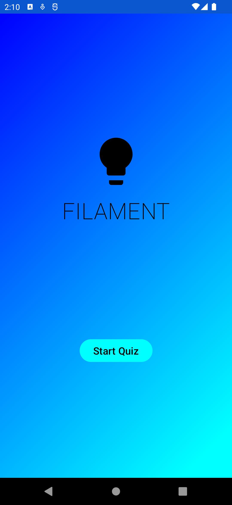
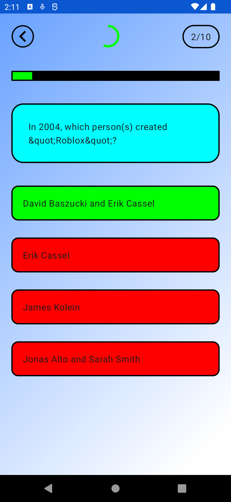
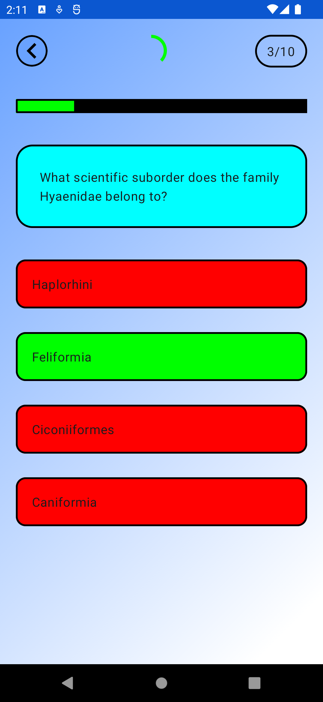
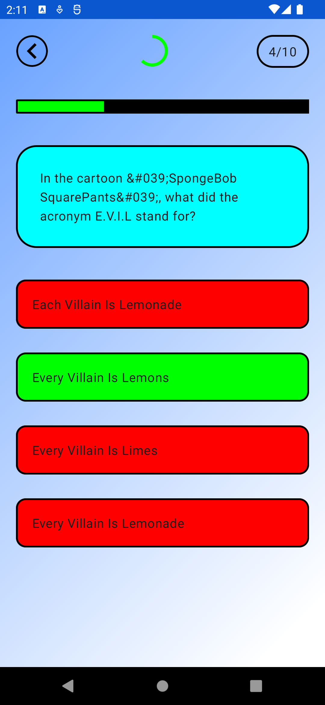
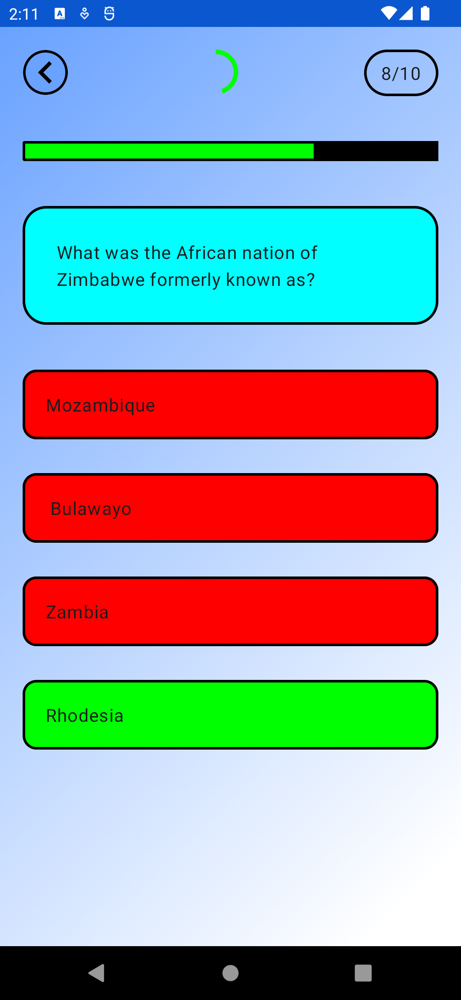
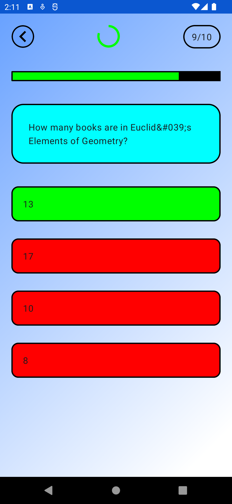
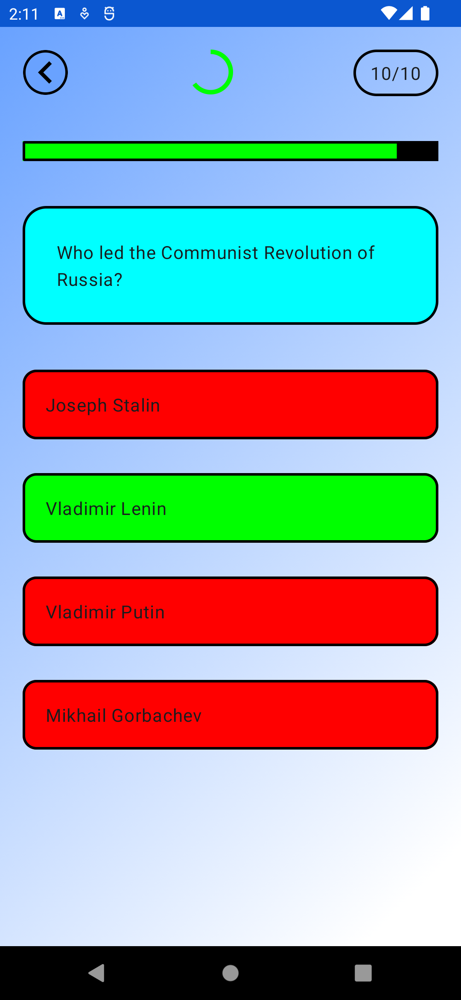

# Filament - Jetpack Quiz App

## Screens✨

- Splash
- Loading
- Quiz
- End

## Functionalities

- Start Quiz
- Display dynamic set of 10 questions
- Choose the correct answer
- Answer Highlight and Quiz Loader 
- Quiz questions progress bar

## Libraries Used

- Open DB API - https://opentdb.com/
- Jetpack Compose
- ViewModel, Dagger Hilt, Retrofit

## Screenshots

